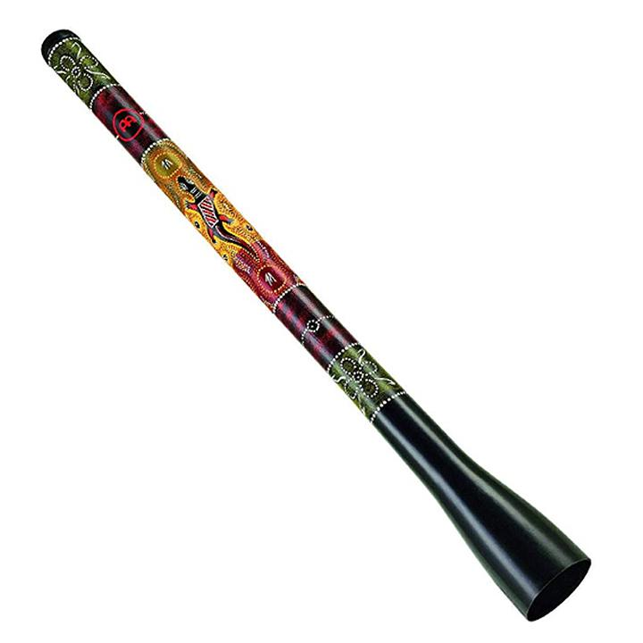

---
output:
  word_document: default
  html_document: default
---
```{r include = FALSE}
if(!knitr:::is_html_output())
{
  options("width"=56)
  knitr::opts_chunk$set(tidy.opts=list(width.cutoff=56, indent = 2), tidy = TRUE)
  knitr::opts_chunk$set(fig.pos = 'H')
}
```

# Learning Goals and Success

The learning goals for this activity are for students to: 

- Develop an awareness of the science and history of the didgeridoo and the paixiao
- Practice hands-on construction methods to create custom, playable PVC musical instruments
- Develop an awareness of long-term trends in climate data
- Create a collaborative musical piece inspired by climate data
- Perform the custom musical piece using the didgeridoo and/or the paixiao 

Success will be determined by:

- Creation of playable PVC musical instruments
- Creation and performance of a musical piece inspired directly by trends in global climate data

```{r echo = FALSE, fig.cap = 'Didgeridoo.'}

```