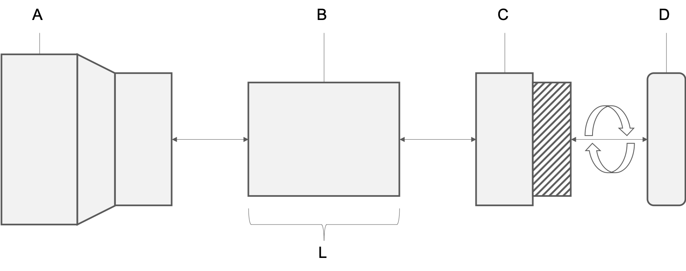
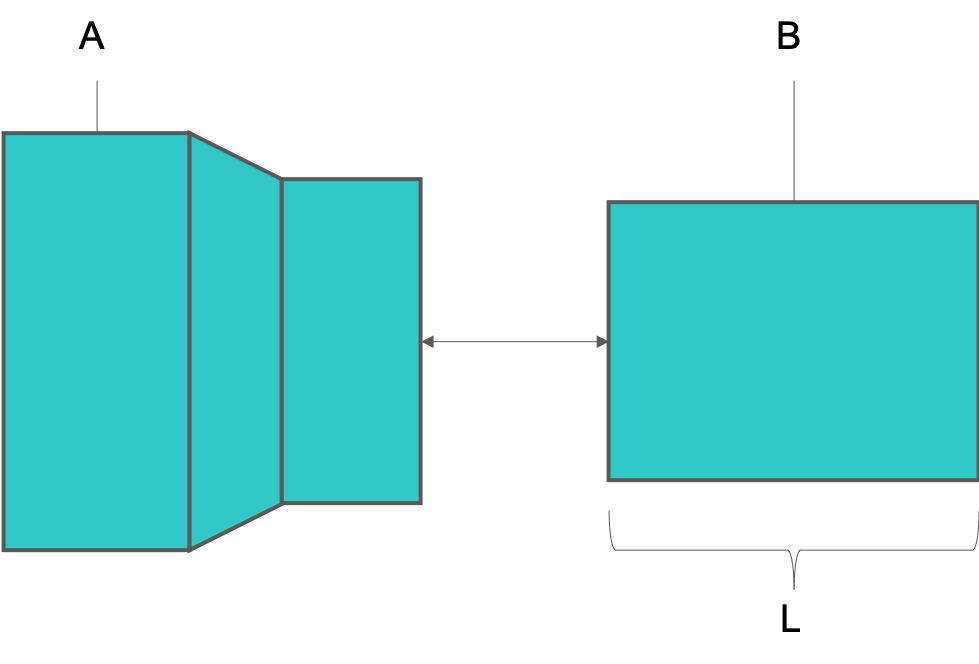
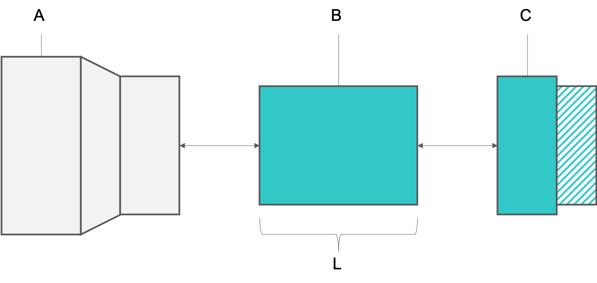
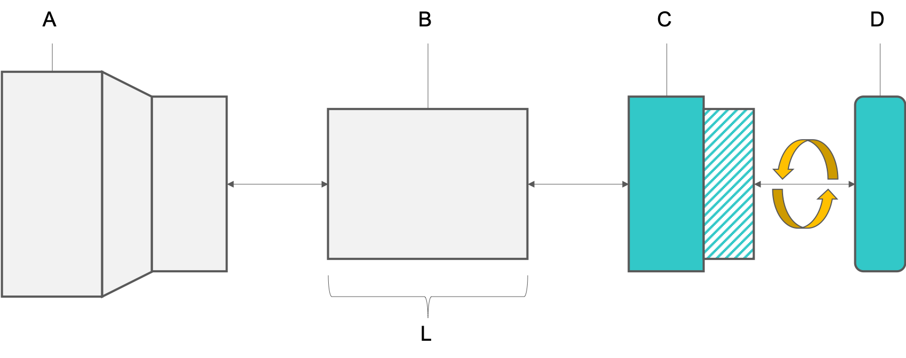
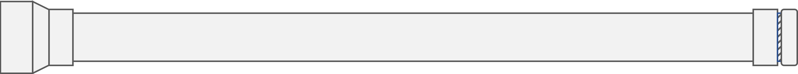
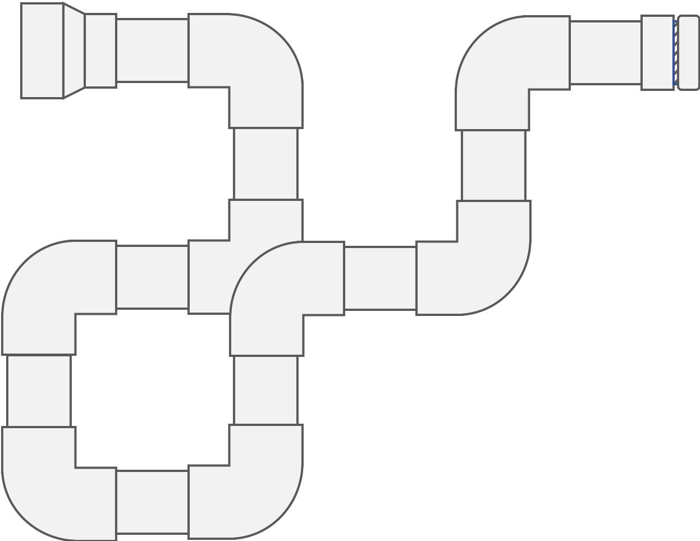

---
output:
  pdf_document: default
  html_document: default
  word_document: default
---
```{r include = FALSE}
if(!knitr:::is_html_output())
{
  options("width"=56)
  knitr::opts_chunk$set(tidy.opts=list(width.cutoff=56, indent = 2), tidy = TRUE)
  #knitr::opts_chunk$set(fig.pos = 'H')
  knitr::opts_chunk$set(echo = TRUE, fig.align="center")
}
```
# Didgeridoo Construction

## Overview
TODO

## Construction
The didgeridoo will be constructed from three PVC components seen in Figure \@ref(fig:construction): a reducing coupling (A), a pipe (B) , and a trap adapter (C and D). The length (L) of the pipe is variable and determines the key of the instrument. The mouthpiece is in two pieces. Part D will need to be threaded onto Part C. All other fittings should be pressed on until secure. No adhesives are used in this construction.

```{r construction, echo = FALSE, fig.cap = 'PVC didgeridoo construction', fig.width=6, out.width = '50%'}

```

To begin, join the reducing coupling (A) to the pipe (B).
```{r constructionA, echo = FALSE, fig.cap = 'PVC didgeridoo construction, part A', fig.width=6, out.width = '50%'}

```

Next, join the pipe (B) to the trap adapter base (C).
```{r constructionB, echo = FALSE, fig.cap = 'PVC didgeridoo construction, part B', fig.width=6, out.width = '50%'}

```

Finally, join the trap adapter base (C) to the trap adapter nut (D) by carefully threading the nut onto the base.
```{r constructionC, echo = FALSE, fig.cap = 'PVC didgeridoo construction, part C', fig.width=6, out.width = '50%'}

```

Your PVC didgeridoo should now be fully assembled. Wipe down the trap adapter with an alcohol pad before attempting to play!

## Standard Form
The didgeridoo can be created in many forms. The standard form, which is the focus of this activity, results in a simple straight form.

```{r assembled, echo = FALSE, fig.cap = 'PVC didgeridoo; standard form', fig.width=6, out.width = '50%'}

```

## Alternative Forms
Alternative forms can result in more compact, twisted variations. These forms require extensive cutting and the use of angled fittings. One example is presented here for inspiration. With these forms, students can create longer didgeridoos and deeper, more resonant notes while occupying minimal space. 

```{r alternative, echo = FALSE, fig.cap = 'PVC didgeridoo; standard form', fig.width=6, out.width = '50%'}

```

## Tuning
TODO
