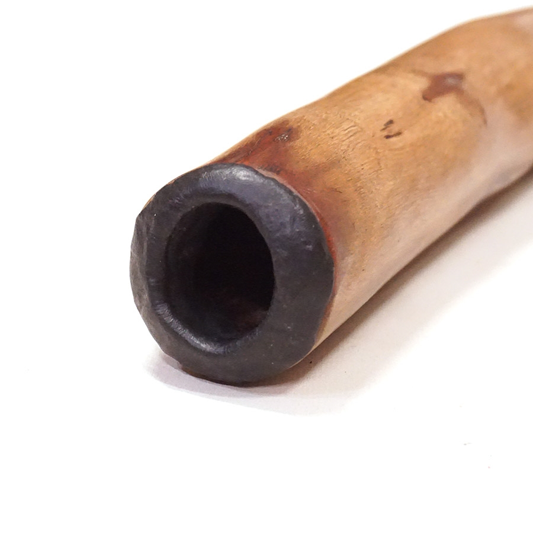
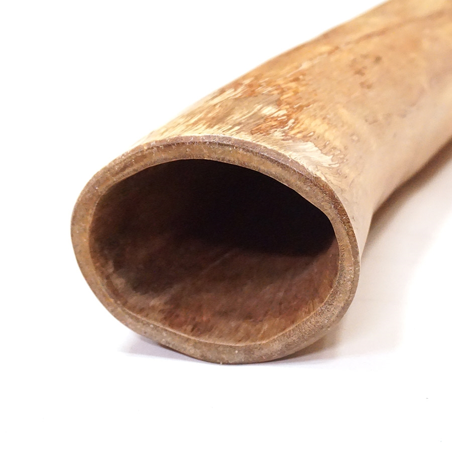

---
output:
  pdf_document: default
  html_document: default
  word_document: default
---
```{r include = FALSE}
if(!knitr:::is_html_output())
{
  options("width"=56)
  knitr::opts_chunk$set(tidy.opts=list(width.cutoff=56, indent = 2), tidy = TRUE)
  #knitr::opts_chunk$set(fig.pos = 'h',  fig.align="center")
}
```
# Didgeridoo 

## Overview
The theme of 2019 MIT STEAM Camp is wind and perhaps an exploration of climate data and wind instruments can faithfully incorporate the theme as well as help inform the public about information to which they may not have been exposed. This chapter describes a bit about the didgeridoo, a wind instrument of great significance, and presents instruction for construction of a DIY version that can be created inexpensively and with a high degree of customization. 

## History and Significance
The didgeridoo, or yidaki, is an ancient wind instrument believed to have originated among the indigenous people of northern Australia over 40,000 years ago [@harris]. This instrument is traditionally used for cermonial functions and also for recreational and entertainment purposes. Ramin Yazdanpanah is a modern didgeridoo musician who plays with the [Maharajah Flamenco Trio](https://www.mftrio.com/), a group that incorporates global sounds into their music. 

```{r yaz, echo = FALSE, fig.cap = 'Ramin Yazdanpanah of the Maharajah Flamenco Trio from the official video for "Dariya." Roughcut Productions, 2017.', fig.width=6, out.width = '50%',fig.align="center"}
knitr::include_graphics("img/yaz.png")
```

## Anatomy
A traditional didgeridoo has essentially three components: the mouthpiece, the body, and the bell or flare. The mouthpiece is a small opening usually formed with beeswax. The body is hollowed out, usually by termites. The flare is a natural widening of the body where a trunk or branch meets the ground or larger section of the tree. 

```{r echo = FALSE, fig.cap = 'Mouthpiece detail of a Large Jesse Lethbridge Didgeridoo (4845). Seen at [DidgeridooBreath.com](https://www.didgeridoobreath.com/Large-Jesse-Lethbridge-Didgeridoo-4845-p/d-575-4845.htm)', fig.width=6, out.width = '50%', fig.align="center"}

```

```{r echo = FALSE, fig.cap = 'Bell detail of a Large Jesse Lethbridge Didgeridoo (4845). Seen at [DidgeridooBreath.com](https://www.didgeridoobreath.com/Large-Jesse-Lethbridge-Didgeridoo-4845-p/d-575-4845.htm)', fig.width=6, out.width = '50%', fig.align="center"}

```

## Science
@timbres sums up an article by @tarnopolsky and notes that skilled didgeridoo musicians can adjust their throat anatomy to produce a very wide range of [timbres](https://en.wikipedia.org/wiki/Timbre). @fletcher provides a summary of the physics of this simple instrument. 

## Construction
The didgeridoo will be constructed from three PVC components seen in Figure \@ref(fig:construction): a reducing coupling (A), a pipe (B) , and a trap adapter (C and D). The length (L) of the pipe is variable and determines the key of the instrument. The mouthpiece is in two pieces. Part D will need to be threaded onto Part C. All other fittings should be pressed on until secure. No adhesives are used in this construction.

```{r construction, echo = FALSE, fig.cap = 'PVC didgeridoo construction', fig.width=6, out.width = '50%',fig.align="center"}
knitr::include_graphics("img/construction.png")
```

To begin, join the reducing coupling (A) to the pipe (B).
```{r constructionA, echo = FALSE, fig.cap = 'PVC didgeridoo construction, part A', fig.width=6, out.width = '50%',fig.align="center"}
knitr::include_graphics("img/constructionA.png")
```

Next, join the pipe (B) to the trap adapter base (C).
```{r constructionB, echo = FALSE, fig.cap = 'PVC didgeridoo construction, part B', fig.width=6, out.width = '50%',fig.align="center"}
knitr::include_graphics("img/constructionB.png")
```

Finally, join the trap adapter base (C) to the trap adapter nut (D) by carefully threading the nut onto the base.
```{r constructionC, echo = FALSE, fig.cap = 'PVC didgeridoo construction, part C', fig.width=6, out.width = '50%',fig.align="center"}
knitr::include_graphics("img/constructionC.png")
```

Your PVC didgeridoo should now be fully assembled. Wipe down the trap adapter with an alcohol pad before attempting to play!

## Standard Form
While traditional hollow-branch didgeridoos are generally straight, the PVC didgeridoo can be created in many forms. The standard straight form is the simplest design with a single length of pipe connecting the mouthpiece to the flared bell (our reducing coupling) at the opposite end.

```{r assembled, echo = FALSE, fig.cap = 'PVC didgeridoo; standard form', fig.width=6, out.width = '50%',fig.align="center"}

```

## Alternative Forms
Alternative forms can result in more compact, twisted variations. These forms require extensive cutting and the use of angled fittings. One example is presented here for inspiration. With these forms, students can create longer didgeridoos and deeper, more resonant notes while occupying minimal space. What new form can you create?

```{r alternative, echo = FALSE, fig.cap = 'PVC didgeridoo; standard form', fig.width=6, out.width = '50%',fig.align="center"}
knitr::include_graphics("img/alternative.png")
```

## Tuning
According to @tuning, the length of a didgeridoo for a particular desired frequency (also called the "key" of the didgeridoo) can be found using the formula $l = c/4f$ where $l$ is the length in meters, $c$ is the speed of sound in meters per second, and $f$ is the desired frequency in Hertz (or key). We'll do our calculations using the metric system so, as an example, let's find the length of a didgeridoo that will play in the key of E (82.41Hz). We can do this by solving for the equation $l = 344/(4*82.41)$. We use 344 m/s because that is the speed of sound in dry air at a temperature of 20 degrees C. Solving this gives us a didgeridoo length of $344/329.64$ or about 1.04 meters. It's good practice to start with a didgeridoo that is longer than needed and then you can cut and sand the PVC pipe to the desired length and key. See below for a data table of keys, frequencies (Hz), and estimated pipe lengths (mm). To estimate the key for a didgeridoo of a known length, solve the formula for $f$ instead to get $f = c/4l$ where $l$ is again the length of the didgeridoo in meters.  

For a PVC didgeridoo, @tuning recommends beginners cut their didgeridoo to 104cm for key of E, 118 cm long for a D, or 132 cm long for a C as these are easier keys with which to begin practicing. 

```{r echo = FALSE}
keys<-c("C", "C#", "D", "D#", "E", "F", "F#", "G", "G#", "A", "A#", "B", "C", "C#", "D", "D#", "E", "F", "F#", "G", "G#", "A", "A#", "B","C", "C#", "D", "D#", "E")
freq<-c(32.70,34.65,36.71,38.89,41.20,43.66,46.25,49.00,51.91,55.00,58.27,61.74,65.40,69.30,73.42,77.78,82.41,87.31,92.50,98.00,103.82,110.00,116.54,123.47,130.81,138.59,146.83,155.56,164.81)
len<-c(2630,2482,2342,2211,2087,1970,1859,1755,1657,1564,1475,1393,1315,1241,1171,1106,1044,985,930,878,828,782,771,696,657,620,586,553,522)
keyDF<-data.frame(keys,freq,len)
names(keyDF) <- c("Key", "Frequency (Hz)", "Length (mm)")

knitr::kable(
  keyDF, booktabs = TRUE,
  caption = 'Musical key, frequency, and estimated didgeridoo length.'
)
```

## Mouthpiece
The traditional didgeridoo mouthpiece is beeswax. To try this out instead of a plastic fitting, gather a small amount of beeswax, warm it in the sun, microwave (very briefly, ~10 seconds), or oven (very low temperatures). You want the wax to be soft enough to mold, but not close to melting. Make a cylinder with a small diameter and then coil the wax around the end of the didgeridoo. Press it gently and mold it to create an opening around 35mm to start. Try it out and keep working it until it feels comfortable.

You can watch this video from Spirit Gallery to watch how they apply beeswax to a didgeridoo: [How to add a Didgeridoo Beeswax Mouthpiece.](https://www.youtube.com/watch?v=iYilUrkJ9ow) 

<iframe width="560" height="315" align="middle" src="https://www.youtube.com/embed/iYilUrkJ9ow" frameborder="0" allowfullscreen></iframe>


## Decoration
According to @harris, the didgeridoo may be decorated. Many designs are inspired by nature and traditional pigments contributed an array of earth-tone hues to the instrument. See Figure \@ref(fig:patternsA) for some examples. 

```{r patternsA, echo = FALSE, fig.cap = 'Didgeridoo decorations. Photo by Bernard Spragg, NZ. Public Domain.', fig.width=6, out.width = '50%',fig.align="center"}
knitr::include_graphics("img/patternsA.jpg")
```

## Play
At the most basic level, the didgeridoo is a very simple tube, traditionally a hollowed-out eucalyptus branch or trunk eaten away from the inside by termites. This wind instrument, also classified as a brass aerophone, is deceptively simple however. The physical characteristics of the instrument, paired with the skill of the musician, allow for a wide variety of sounds that may incorporate percussion, vocalization, and intricate droning techniques. For more information on terminology such as resonance, backpressure, and different types of notes, investigate [the information](https://www.spiritgallery.com.au/didgeridoo-terminology) presented by @terminology. These concepts may help students to think of some methods they can try to incorporate into their playing style. 

It's a great idea to watch some videos online to hear musicians play different styles, different instruments in a variety of keys, and to hear artists practice as a band. One popular channel on YouTube is [DidgeridooBreath](https://www.youtube.com/user/DidgeridooBreath/videos). 

Here's [a video of Sanshi providing a good intro to the didgeridoo](https://www.youtube.com/watch?v=W2gwTPPtgPI):

<iframe width="560" height="315" align="middle" src="https://www.youtube.com/embed/W2gwTPPtgPI" frameborder="0" allowfullscreen></iframe>


Sanshi plays a lot of didgeridoo demonstrations to provide customers with an idea of how each instrument sounds. Here's a video entitled "[Ellswood Didge C (No.2202) Didgeridoo Demo.](https://www.youtube.com/watch?v=Kwq6GKDDGXY)"

<iframe width="560" height="315" align="middle" src="https://www.youtube.com/embed/Kwq6GKDDGXY" frameborder="0" allowfullscreen></iframe>


A didgeridoo is featured in "[Dariya](https://www.youtube.com/watch?v=M45Eh2oZrL8)" performed here as a Tiny Desk Concert entry by [Maharajah Flamenco Trio](https://www.mftrio.com/about-us) from Tallahassee, Florida, USA. Performed by Ramin Yazdanpanah on cajon \& didgeridoo, David Cobb on bass, and Silviu Ciulei on guitar. 

<iframe width="560" height="315" align="middle" src="https://www.youtube.com/embed/M45Eh2oZrL8" frameborder="0" allowfullscreen></iframe>

## Advanced Play: Circular Breathing
If you want to advance your playing, you'll need to learn circular breathing. This technique allows for very long, continuous droning by providing a constant stream of air into the didgeridoo. @tuning provides the following tips for practicing and learning this advanced technique. Essentially, you'll push air that you stored in your mouth out while you breathe in through your nose to replenish the supply in your lungs.  

-Breathe in and out of your nose normally. relax
-Fill your mouth with some water and tilt your head back and again breathe in and out of your nose normally. Keep breathing for at least a couple of minutes. relax
-Without water, fill your mouth with air at a fair pressure and keep breathing in and out through your nose for a couple of minutes while keeping the air in the mouth. relax
-Do the same thing again and this time have your thumb and index finger of one hand just touching your cheeks while breathing in and hovering just above the cheeks when breathing out. Relax
-Do the same thing again and this time make the in-breath fast and strong and the out-breath long and constant - still with the fingers and still keeping all the air in while breathing in and out through the nose. Relax
-Do the same thing again and this time after taking a few breath, push your cheeks with your fingers to expel the air out of your mouth while breathing in. Bingo. Relax

Here's Sanshi from the Didgeridoo Dojo giving a brief intro to the technique: [Didgeridoo Circular Breathing: Introduction (Lesson 1 of 8)](https://www.youtube.com/watch?v=tI6qr5amKuE)

<iframe width="560" height="315" align="middle" src="https://www.youtube.com/embed/tI6qr5amKuE" frameborder="0" allowfullscreen></iframe>