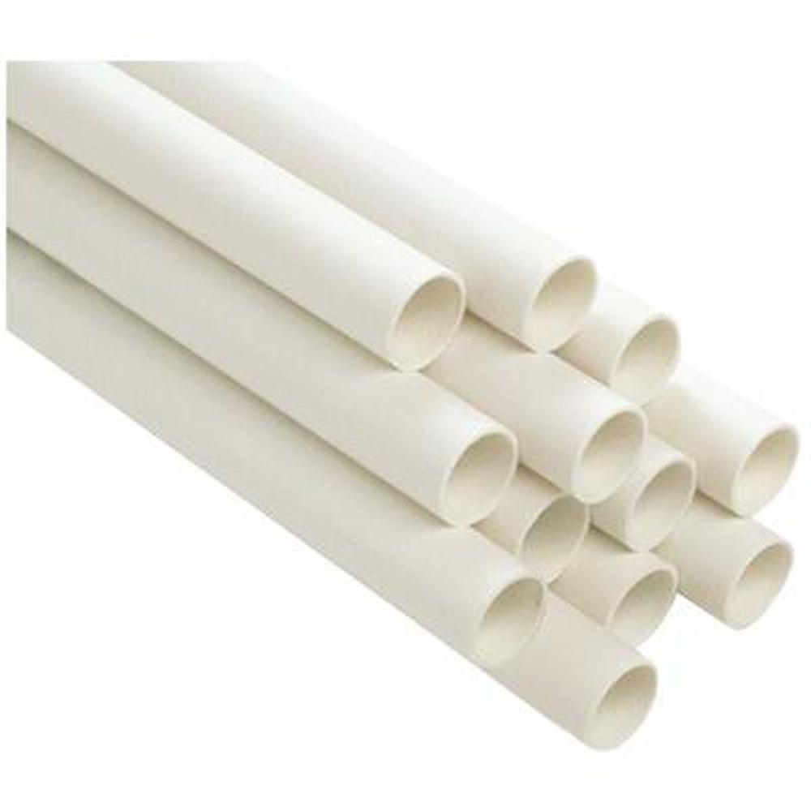
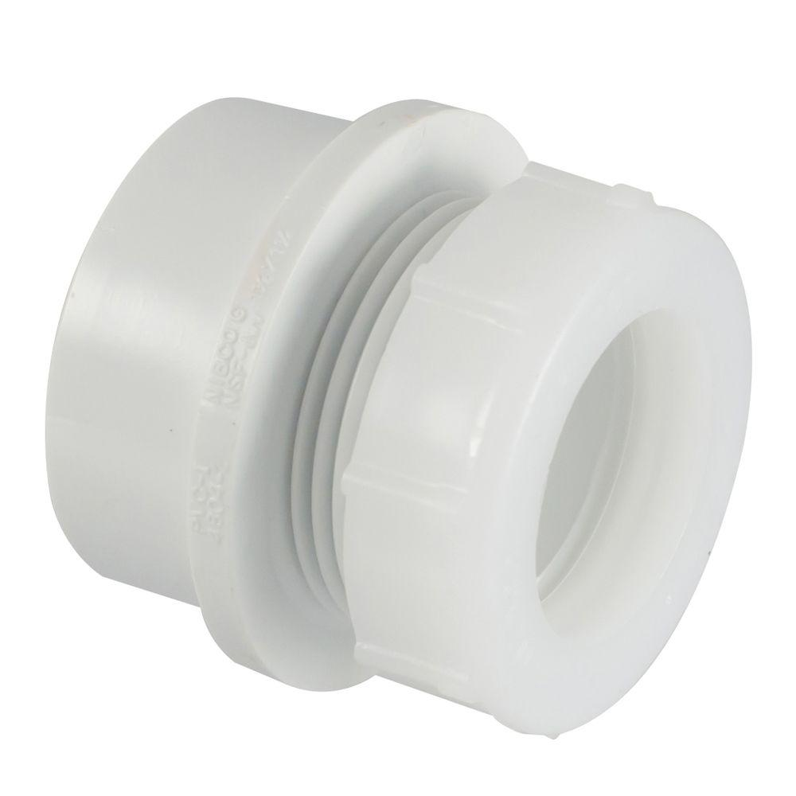
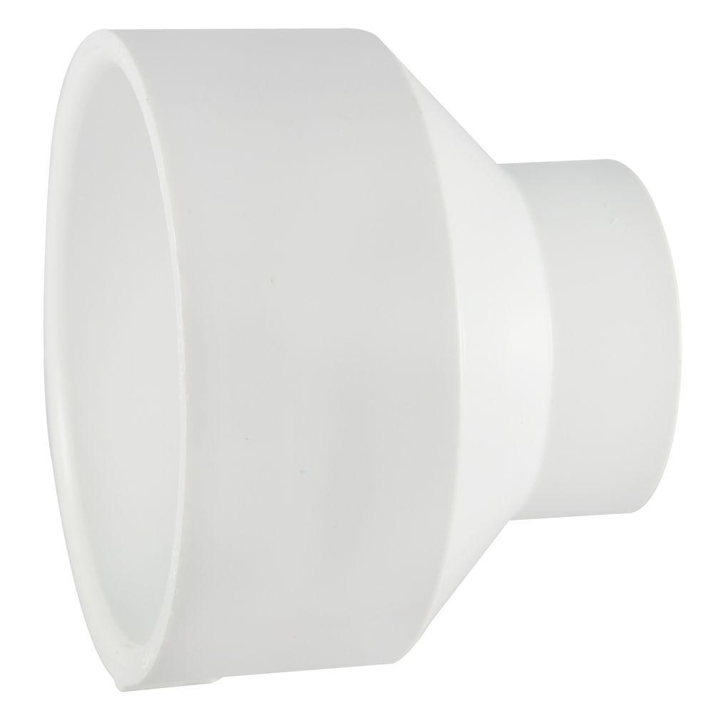
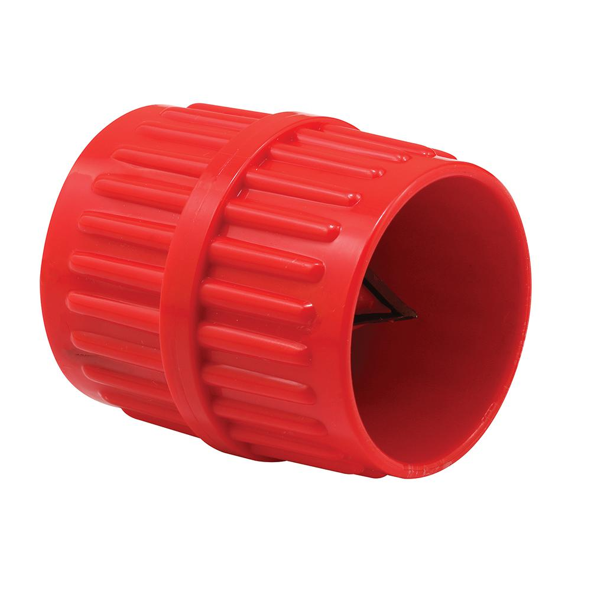
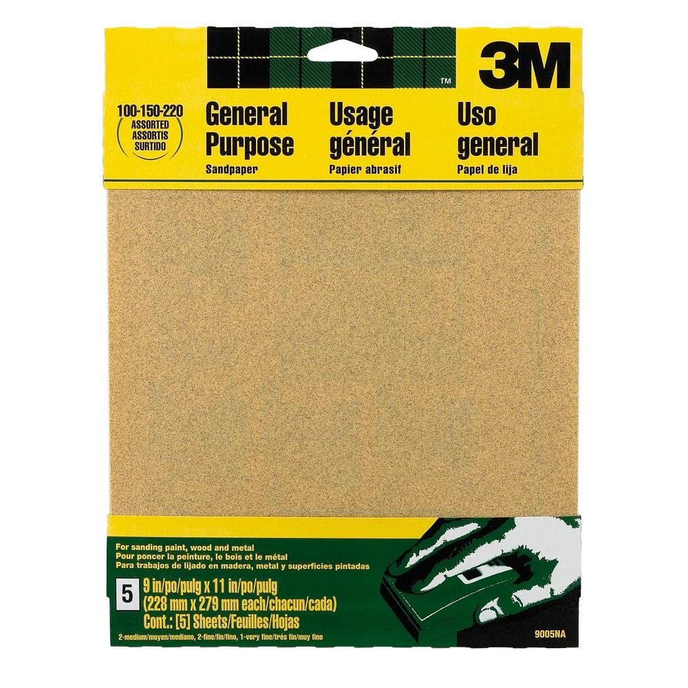
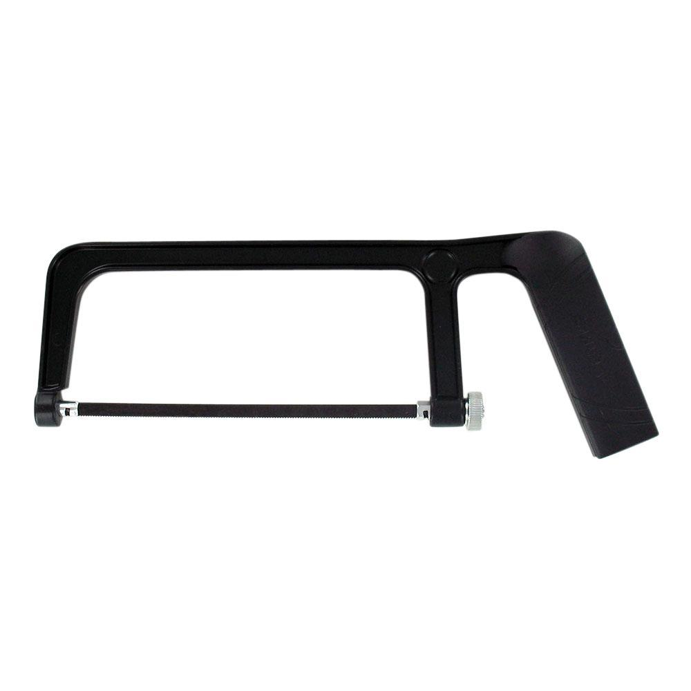
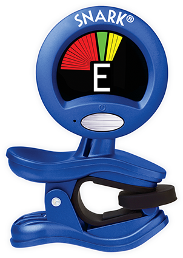
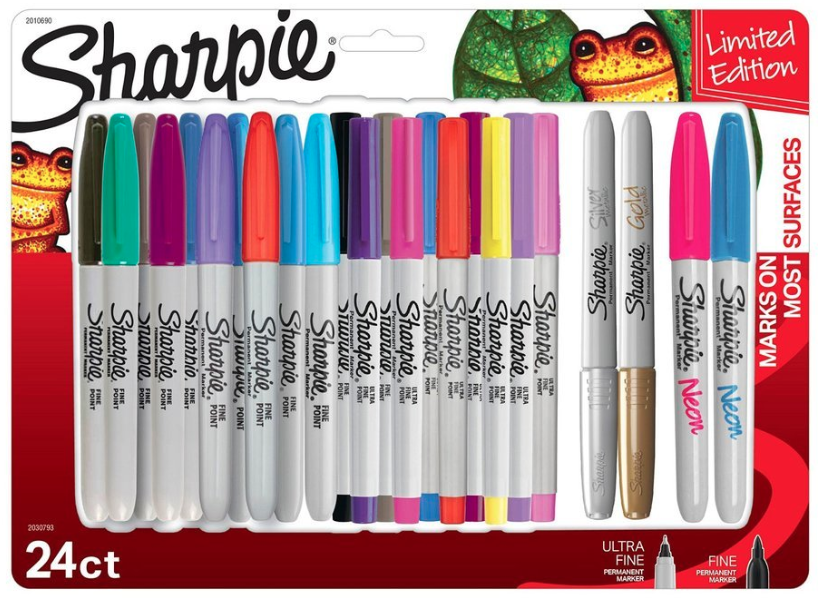
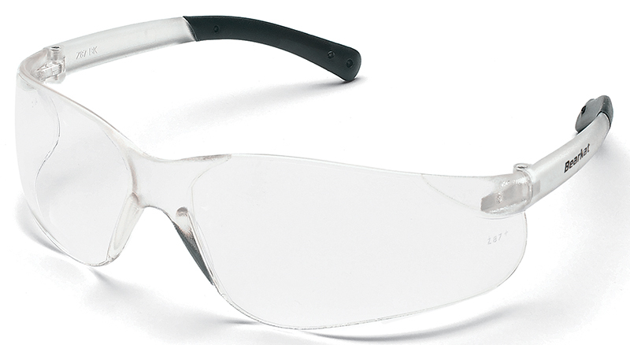

---
output:
  word_document: default
  html_document: default
---
```{r include = FALSE}
if(!knitr:::is_html_output())
{
  options("width"=56)
  knitr::opts_chunk$set(tidy.opts=list(width.cutoff=56, indent = 2), tidy = TRUE)
  #knitr::opts_chunk$set(fig.pos = 'h',  fig.align="center")
}
```
# Materials and Tools List

This chapter describes the materials and tools needed to construct a basic PVC didgeridoo and a basic PVC paixiao.

## PVC Didgeridoo

```{r echo = FALSE}
didgeridooMaterials<-c( "PVC pipe", 
                        "PVC trap adapter",
                        "PVC Reducing Coupling",
                        "Sandpaper	Medium Grit",
                        "Sandpaper	Coarse Grit",
                        "Alcohol Prep Pads"
                        )
didgeridooSpecsImperial<-c( "1.5\", Schedule 40", 
                        "1.5\", Schedule 40",
                        "3.0\"x1.5\", Schedule 40",
                        "Medium Grit",
                        "Coarse Grit",
                        "-"
                        )
didgeridooQtyImperial<-c( "10\'", 
                        "1",
                        "1",
                        "as needed",
                        "as needed",
                        "as needed"
                        )
didgeridooMaterialsDF<-data.frame(didgeridooMaterials,didgeridooSpecsImperial,didgeridooQtyImperial)
names(didgeridooMaterialsDF) <- c("Materials", "Specifications (Imperial)", "Quantity or Length (Imperial)")


toolNames<-c( "PVC Reamer", 
              "Hacksaw", 
              "Digital Tuner", 
              "Permanent markers, multicolor",
              "Safety glasses"
              )
toolSpecs<-c( "> 1.5\"", 
              "small", 
              "multi-instrument, clip-on or phone app", 
              "any color",
              "polycarbonate, ANSI Z87.1-2015 or similar"
              )
toolQty<-c( "1", 
            "1", 
            "1", 
            "any",
            "1 pair per student"
            )

toolsDF<-data.frame(toolNames, toolSpecs, toolQty)
names(toolsDF) <- c("Name", "Specifications (Imperial)", "Quantity (Imperial)")
```

```{r, echo=FALSE}
knitr::kable(
  didgeridooMaterialsDF, booktabs = TRUE,
  caption = 'Materials for constructing a PVC Didgeridoo.'
)
```

```{r, echo=FALSE}
knitr::kable(
  toolsDF, booktabs = TRUE,
  caption = 'Tools for constructing a PVC Didgeridoo.'
)
```

## PVC Paixiao
```{r echo = FALSE}
paixiaoMaterials<-c( "PVC pipe",
                     "PVC cap",
                        "Sandpaper	Medium Grit",
                        "Sandpaper	Coarse Grit",
                        "Alcohol Prep Pads",
                      "Duct tape or hot glue"
                        )
paixiaoSpecsImperial<-c( "0.5\", Schedule 40", 
                         "0.5\", Schedule 40",
                        "Medium Grit",
                        "Coarse Grit",
                        "-",
                        "-"
                        )
paixiaoQtyImperial<-c( "3\'",
                       "3 to 5, as needed",
                        "1",
                        "1",
                        "as needed",
                        "as needed"
                        )
paixiaoMaterialsDF<-data.frame(paixiaoMaterials,paixiaoSpecsImperial,paixiaoQtyImperial)
names(paixiaoMaterialsDF) <- c("Materials", "Specifications (Imperial)", "Quantity or Length (Imperial)")
```

```{r, echo=FALSE}
knitr::kable(
  paixiaoMaterialsDF, booktabs = TRUE,
  caption = 'Materials for constructing a PVC Paixiao.'
)
```

```{r, echo=FALSE}
knitr::kable(
  toolsDF, booktabs = TRUE,
  caption = 'Tools for constructing a PVC Paixiao.'
)
```

## Materials and Tools Gallery

```{r pvcPipe, echo = FALSE, fig.cap = 'PVC Pipe, [Image Source](https://www.homedepot.com/p/Genova-Products-PVC-Schedule-40-Pressure-Pipe-1-1-2-in-x-10-ft-Plain-End-70011N/300282341)', fig.width=6, out.width = '50%', fig.align="center"}

```

```{r pvcTrapAdapter, echo = FALSE, fig.cap = 'PVC Trap Adapter, [Image Source](https://www.homedepot.com/p/Nibco-1-1-2-in-x-1-1-2-in-PVC-DWV-Trap-Adapter-C480127HD112114/100342402)', fig.width=6, out.width = '50%', fig.align="center"}

```

```{r pvcReducingCoupling, echo = FALSE, fig.cap = 'PVC Reducing Coupling, [Image Source](https://www.homedepot.com/p/3-in-x-1-1-2-in-PVC-DWV-Reducing-Coupling-C4801HD3112/100343439)', fig.width=6, out.width = '50%', fig.align="center"}

```

```{r pvcReamer, echo = FALSE, fig.cap = 'PVC Reamer, [Image Source](https://www.homedepot.com/p/Armour-Line-1-8-in-1-5-8-in-Dia-Pipe-and-Tubing-Reamer-Red-RP77271/306699486)', fig.width=6, out.width = '50%', fig.align="center"}

```

```{r sandpaperMedium, echo = FALSE, fig.cap = 'Medium-grit sandpaper, [Image Source](https://www.homedepot.com/p/3M-9-in-x-11-in-100-150-220-Grit-Medium-Fine-and-Very-Fine-Aluminum-Oxide-Sand-Paper-5-Sheets-Pack-9005NA/203783586)', fig.width=6, out.width = '50%', fig.align="center"}

```

```{r sandpaperCoarse, echo = FALSE, fig.cap = 'Coarse-grit sandpaper, [Image Source](https://www.homedepot.com/p/Fandeli-9-in-x-11-in-60-Grit-Coarse-Premium-Aluminum-Oxide-Sandpaper-25-Pack-36021/206443022)', fig.width=6, out.width = '50%', fig.align="center"}
knitr::include_graphics("img/sandpaperCoarse.jpg")
```

```{r alcoholPrepPads, echo = FALSE, fig.cap = 'Alcohol prep pads, [Image Source](https://www.amazon.com/Care-Touch-Sterile-Alcohol-Medium/dp/B06XS38XH6)', fig.width=6, out.width = '50%', fig.align="center"}

```

```{r hacksaw, echo = FALSE, fig.cap = 'Hacksaw, [Image Source](https://www.homedepot.com/p/Husky-6-in-Hack-Saw-with-Comfort-Grip-Handle-122JHSC/204748808?MERCH=REC-_-PIPHorizontal2_rr-_-303858480-_-204748808-_-N)', fig.width=6, out.width = '50%', fig.align="center"}

```

```{r digitalTuner, echo = FALSE, fig.cap = 'Clip-on tuner, [Image Source](http://www.snarktuners.com/products/original-clip-on)', fig.width=6, out.width = '50%', fig.align="center"}

```

```{r permanentMarkers, echo = FALSE, fig.cap = 'Permanent markers, [Image Source](https://www.amazon.com/Sharpie-Permanent-Marker-Multi-Color/dp/B077TJS66N)', fig.width=6, out.width = '50%', fig.align="center"}

```

```{r safetyGlasses, echo = FALSE, fig.cap = 'Safety glasses, [Image Source](https://www.safetyglassesusa.com/bk210.html)', fig.width=6, out.width = '50%', fig.align="center"}

```
