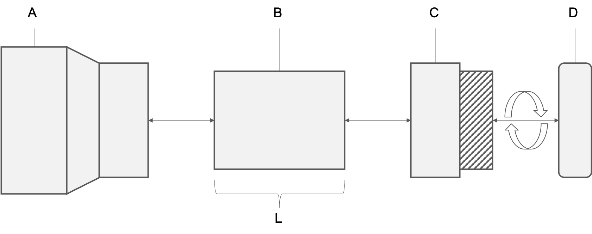

---
output:
  pdf_document: default
  html_document: default
  word_document: default
---

# Didgeridoo 

## Overview
The theme of 2019 MIT STEAM Camp is wind and perhaps an exploration of climate data and wind instruments can faithfully incorporate the theme as well as help inform the public about information to which they may not have been exposed. This chapter describes a bit about the didgeridoo, a wind instrument of great significance, and presents instruction for construction of a DIY version that can be created inexpensively and with a high degree of customization. 

## History and Significance
The didgeridoo, or yidaki, is an ancient wind instrument believed to have originated among the indigenous people of northern Australia over 40,000 years ago [@harris]. This instrument is traditionally used for cermonial functions and also for recreational and entertainment purposes. Ramin Yazdanpanah is a modern didgeridoo musician who plays with the [Maharajah Flamenco Trio](https://www.mftrio.com/), a group that incorporates global sounds into their music. 

(\#fig:yaz)Ramin Yazdanpanah of the Maharajah Flamenco Trio from the official video for "Dariya." Roughcut Productions, 2017.

## Science
@timbres sums up an article by @tarnopolsky and notes that skilled didgeridoo musicians can adjust their throat anatomy to produce a very wide range of [timbres](https://en.wikipedia.org/wiki/Timbre). @fletcher provides a summary of the physics of this simple instrument. 

## Construction
The didgeridoo will be constructed from three PVC components seen in Figure \@ref(fig:construction): a reducing coupling (A), a pipe (B) , and a trap adapter (C and D). The length (L) of the pipe is variable and determines the key of the instrument. The mouthpiece is in two pieces. Part D will need to be threaded onto Part C. All other fittings should be pressed on until secure. No adhesives are used in this construction.

(\#fig:construction)PVC didgeridoo construction

To begin, join the reducing coupling (A) to the pipe (B).

(\#fig:constructionA)PVC didgeridoo construction, part A

Next, join the pipe (B) to the trap adapter base (C).

(\#fig:constructionB)PVC didgeridoo construction, part B

Finally, join the trap adapter base (C) to the trap adapter nut (D) by carefully threading the nut onto the base.

(\#fig:constructionC)PVC didgeridoo construction, part C

Your PVC didgeridoo should now be fully assembled. Wipe down the trap adapter with an alcohol pad before attempting to play!

## Standard Form
While traditional hollow-branch didgeridoos are generally straight, the PVC didgeridoo can be created in many forms. The standard straight form is the simplest design with a single length of pipe connecting the mouthpiece to the flared bell (our reducing coupling) at the opposite end.

(\#fig:assembled)PVC didgeridoo; standard form

## Alternative Forms
Alternative forms can result in more compact, twisted variations. These forms require extensive cutting and the use of angled fittings. One example is presented here for inspiration. With these forms, students can create longer didgeridoos and deeper, more resonant notes while occupying minimal space. What new form can you create?

(\#fig:alternative)PVC didgeridoo; standard form

## Tuning
According to @tuning, the length of a didgeridoo for a particular desired frequency (also called the "key" of the didgeridoo) can be found using the formula $l = c/4f$ where $l$ is the length in meters, $c$ is the speed of sound in meters per second, and $f$ is the desired frequency in Hertz (or key). We'll do our calculations using the metric system so, as an example, let's find the length of a didgeridoo that will play in the key of E (82.41Hz). We can do this by solving for the equation $l = 344/(4*82.41)$. We use 344 m/s because that is the speed of sound in dry air at a temperature of 20 degrees C. Solving this gives us a didgeridoo length of $344/329.64$ or about 1.04 meters. It's good practice to start with a didgeridoo that is longer than needed and then you can cut and sand the PVC pipe to the desired length and key. See below for a data table of keys, frequencies (Hz), and estimated pipe lengths (mm). To estimate the key for a didgeridoo of a known length, solve the formula for $f$ instead to get $f = c/4l$ where $l$ is again the length of the didgeridoo in meters.  

Table: (\#tab:unnamed-chunk-2)Musical key, frequency, and estimated didgeridoo length.

Key    Frequency (Hz)   Length (mm)
----  ---------------  ------------
C               32.70          2630
C#              34.65          2482
D               36.71          2342
D#              38.89          2211
E               41.20          2087
F               43.66          1970
F#              46.25          1859
G               49.00          1755
G#              51.91          1657
A               55.00          1564
A#              58.27          1475
B               61.74          1393
C               65.40          1315
C#              69.30          1241
D               73.42          1171
D#              77.78          1106
E               82.41          1044
F               87.31           985
F#              92.50           930
G               98.00           878
G#             103.82           828
A              110.00           782
A#             116.54           771
B              123.47           696
C              130.81           657
C#             138.59           620
D              146.83           586
D#             155.56           553
E              164.81           522

## Decoration
According to @harris, the didgeridoo may be decorated. Many designs are inspired by nature and traditional pigments contributed an array of earth-tone hues to the instrument. See Figure \@ref(fig:patternsA) for some examples. 

(\#fig:patternsA)Didgeridoo decorations. Photo by Bernard Spragg, NZ. Public Domain.

## Play
At the most basic level, the didgeridoo is a very simple tube, traditionally a hollowed-out eucalyptus branch or trunk eaten away from the inside by termites. This wind instrument, also classified as a brass aerophone, is deceptively simple however. The physical characteristics of the instrument, paired with the skill of the musician, allow for a wide variety of sounds that may incorporate percussion, vocalization, and intricate droning techniques. For more information on terminology such as resonance, backpressure, and different types of notes, investigate the information presented by @terminology. These concepts may help students to think of some methods they can try to incorporate into their playing style. 

It's a great idea to watch some videos online to hear musicians play different styles, different instruments in a variety of keys, and to hear artists practice as a band. One popular channel on YouTube is [DidgeridooBreath](https://www.youtube.com/user/DidgeridooBreath/videos). 

Here's a video of Sanshi providing a good intro to the didgeridoo:

<iframe width="560" height="315" src="https://www.youtube.com/watch?v=W2gwTPPtgPI" frameborder="0" allowfullscreen></iframe>

Sanshi plays a lot of didgeridoo demonstrations to provide customers with an idea of how each instrument sounds. Here's a video entitled "[Ellswood Didge C (No.2202) Didgeridoo Demo.](https://www.youtube.com/watch?v=Kwq6GKDDGXY)"

A didgeridoo is featured in "Dariya" performed here as a Tiny Desk Concert entry by Maharajah Flamenco Trio from Tallahassee, Florida, USA. Performed by Ramin Yazdanpanah on cajon \& didgeridoo, David Cobb on bass, and Silviu Ciulei on guitar. 

