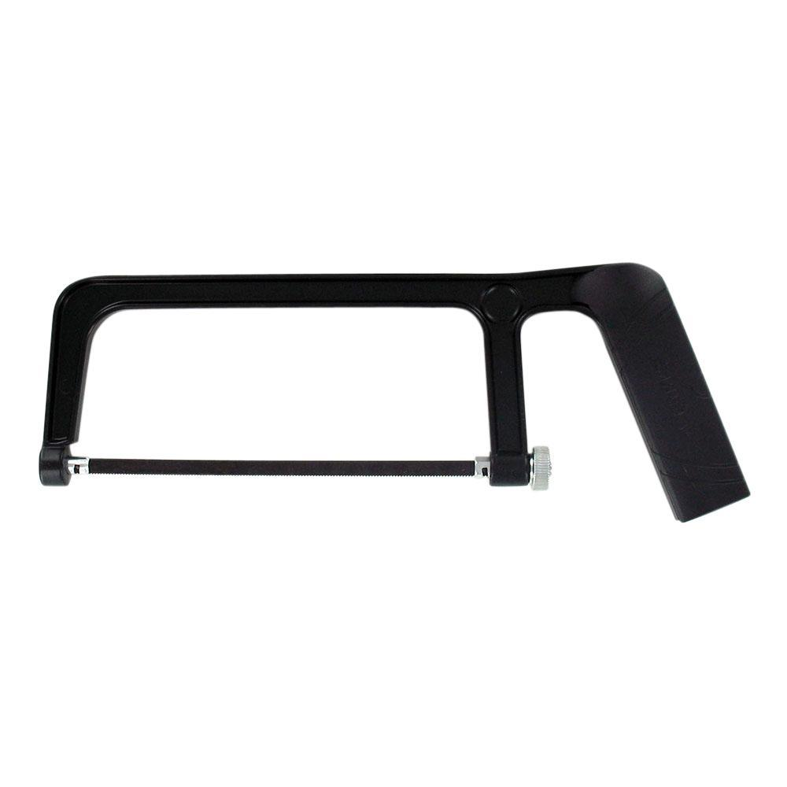

---
output:
  html_document: default
  word_document: default
---

# Materials and Tools List

This chapter describes the materials and tools needed to construct a basic PVC didgeridoo and a basic PVC paixiao. Please note an optional beeswax mouthpiece may be constructed by molding warm, soft wax around one end of the PVC didgeridoo. 

## PVC Didgeridoo


Table: (\#tab:unnamed-chunk-3)Materials for constructing a PVC Didgeridoo.

Material                Spec                     Qty (2)     Qty (100) 
----------------------  -----------------------  ----------  ----------
PVC pipe                1.5", Schedule 40        10'         50        
PVC trap adapter        1.5", Schedule 40        1           100       
PVC Reducing Coupling   3.0"x1.5", Schedule 40   1           100       
Sandpaper               Medium Grit              as needed   as needed 
Alcohol Prep Pads       -                        as needed   as needed 


Table: (\#tab:unnamed-chunk-4)Tools for constructing a PVC Didgeridoo.

Name                            Spec                                        Qty (2)         Qty (100)     
------------------------------  ------------------------------------------  --------------  --------------
Hacksaw                         small                                       1               1 per pair    
Digital Tuner                   multi-instrument, clip-on or phone app      1               10            
Permanent markers, multicolor   any color                                   any             as needed     
Safety glasses                  polycarbonate, ANSI Z87.1-2015 or similar   1 per student   1 per student 

## PVC Paixiao


Table: (\#tab:unnamed-chunk-6)Materials for constructing a PVC Paixiao.

Materials               Specifications (Imperial)   Quantity or Length (Imperial) 
----------------------  --------------------------  ------------------------------
PVC pipe                0.5", Schedule 40           3'                            
Small coins             ~0.5" diameter              3 to 5, as needed             
Sandpaper               Medium Grit                 1                             
Alcohol Prep Pads       -                           as needed                     
Duct tape or hot glue   -                           as needed                     


Table: (\#tab:unnamed-chunk-7)Tools for constructing a PVC Paixiao.

Name                            Spec                                        Qty (2)         Qty (100)     
------------------------------  ------------------------------------------  --------------  --------------
Hacksaw                         small                                       1               1 per pair    
Digital Tuner                   multi-instrument, clip-on or phone app      1               10            
Permanent markers, multicolor   any color                                   any             as needed     
Safety glasses                  polycarbonate, ANSI Z87.1-2015 or similar   1 per student   1 per student 

## Materials and Tools Gallery

](img/pvcPipe.jpg)

](img/trapAdapter.jpg)

](img/reducingCoupling.jpg)

<!--
](img/reamer.jpg)
-->

](img/sandpaperMulti.jpg)

<!--
](img/sandpaperCoarse.jpg)
-->

](img/alcoholPrepPads.jpg)

<!--```{r hacksaw, echo = FALSE, fig.cap = 'Hacksaw, [Image Source](https://www.homedepot.com/p/Husky-6-in-Hack-Saw-with-Comfort-Grip-Handle-122JHSC/204748808?MERCH=REC-_-PIPHorizontal2_rr-_-303858480-_-204748808-_-N)', fig.width=6, out.width = '50%', fig.align="center"}

```
-->

](img/tuner.png)

](img/markers.png)

](img/glasses.jpg)
